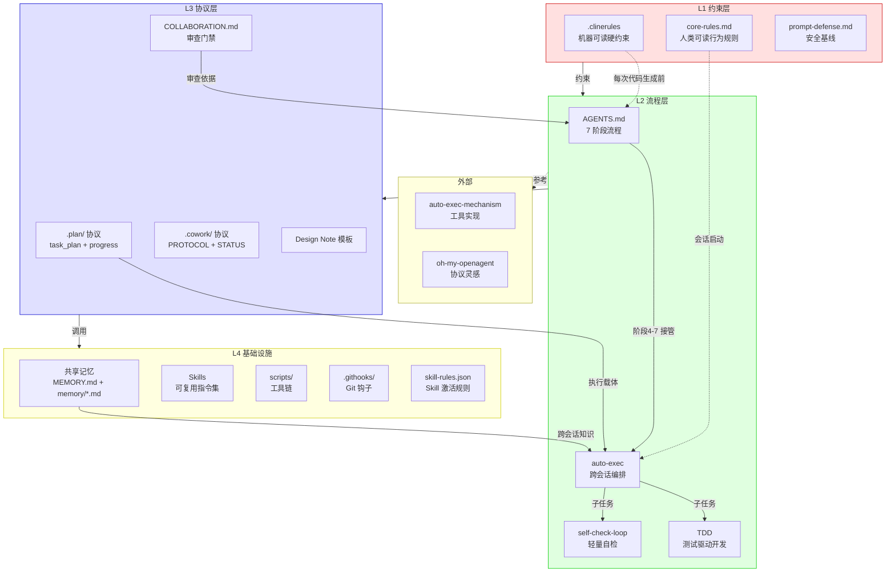
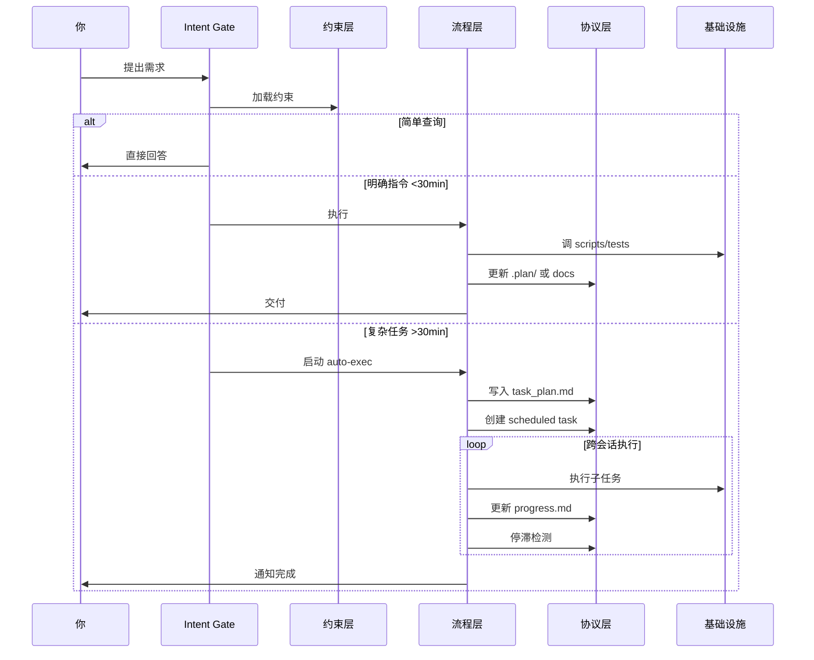

# 所有组件的协作关系图

## 完整架构

## 请求处理流程

## 文件归属矩阵

| 文件 | 所属仓库 | 是否强制 | 说明 |
|------|---------|---------|------|
| `.clinerules` | dev-workflow-spec | ✅ | 每个项目工区分发一份 |
| `core-rules.md` | dev-workflow-spec | ✅ | 每个项目工区分发一份 |
| `prompt-defense.md` | dev-workflow-spec | ✅ | 每个项目工区分发一份 |
| `COLLABORATION.md` | dev-workflow-spec | ✅ | 每个项目工区分发一份 |
| `AGENTS.md` | 子项目 | ✅ | 每个子项目独立维护 |
| `CLAUDE.md` | 子项目 | ✅ | 每个子项目独立维护 |
| `PRD.md` | 子项目 | ✅ | 每个子项目独立维护 |
| `CHANGELOG.md` | 子项目 | ✅ | 每个子项目独立维护 |
| `MEMORY.md` | dev-workflow-spec | 推荐 | 项目工区分发模板 |
| `.cowork/` | dev-workflow-spec | 推荐 | 项目工区分发 |
| `.plan/` | dev-workflow-spec | 按需 | auto-exec 时使用 |
| `feature_gates.yaml` | dev-workflow-spec | 按需 | 需要功能开关时使用 |
| Skill | Cowork 系统 | 按需 | 通过 Cowork 安装 |

## 关键决策记录

| 决策 | 理由 | 日期 |
|------|------|------|
| 双角色模型代替多 Agent | 多 Agent 从未跑通，单线执行效率更高 | 2026-06-25 |
| auto-exec 强制 | >30min/≥3步骤必须编排，否则上下文溢出 | 2026-06-30 |
| 紧急 bug 分级（止血/排查） | 防止紧急修复也被 auto-exec 卡住 | 2026-06-30 |
| 8 轮 self-check 上限 | 超过说明标准太高或任务太模糊 | 2026-06-30 |
| FUSE 禁止 Write/Edit | 已验证多次静默截断 | 2026-06-27 |
